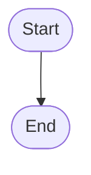

1 --> 2[initialize_game]
2 --> 3[choose_random_number]
3 --> 4[users_time_to_Guess]
5 --> 6[is_it_the_correct_Guess]
6 --> 7[will_it_be_higher_or_low]
7 --> 8[answer_to_high]
7 --> 9[answer_to_low]
9 --> 10 [try_again?]
10 --> 3 